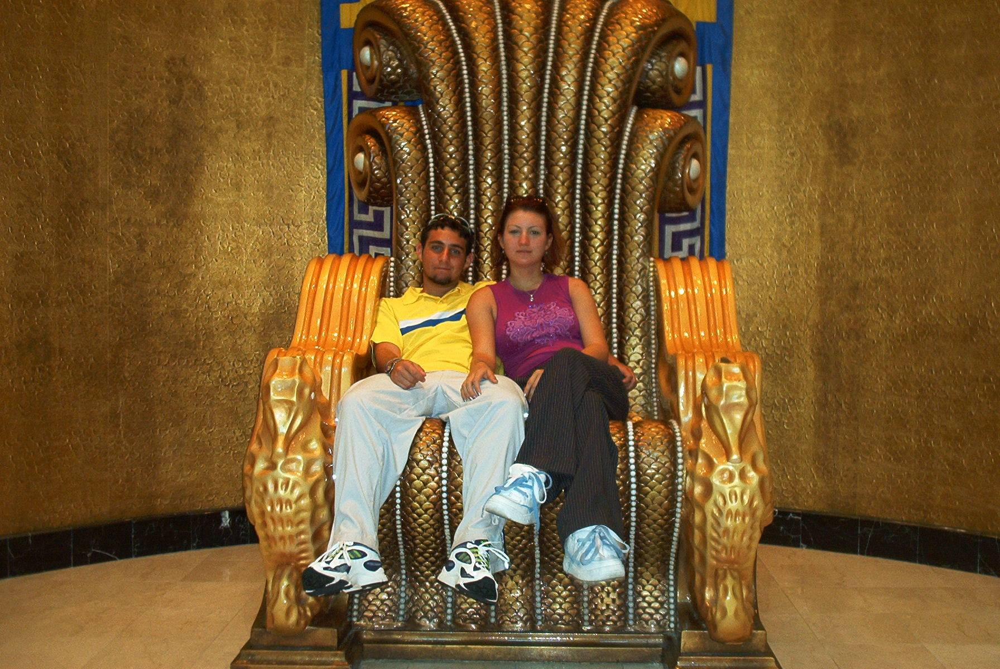
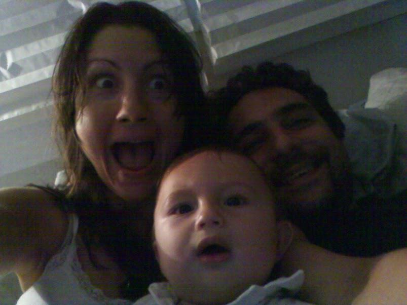

# God

I suppose I've always taken solace in knowing that sometime *in the end* I would be redeemed.  The truth is I don't know this for sure, simply that I've had so much helpful information to share... and because it came to me in such a way that helping the world was my only choice.  I feel like I've fought very hard for you, and in return I've been given nothing but grief.  Today, in complaining about that, I seek to show you what it means for Adam to be redeemed.  I'm going to tell you how I really feel.  I'm reminded of a scene from the Princess Bride--I'm going to be honest (as I always am) because this... this is *for posterity.*  

## A girl tore my reality from me.

She did it by *kicking my heels*, she was re-enacting a scene from Eden... putting enmity between man and woman.  She probably didn't know that, she had no idea what she did to me in 2010.  Everything I thought I knew about the world was torn from me, I was plunged into a deep dark cave, a place where magic was real... where mind control and Hell were sprawled over the face of my Earth.  I had been normal, tortured in secret... even from myself, but normal none the less.  Then the Tribulation happened, and my old love came back to me to tear my heart apart; and that's what she did.  Genesis says that Adam blamed Eve... and for years I would have insisted that it was mind control that I blamed; but today... with her gone, and me filled with the *light of the world*, it's really her that I blame.  I blame her for not standing up to God with me; for being too weak to handle whatever it was that we had to go through together to bring truth the words of the Live song *They Stood Up for Love.*

It's ironic, because I'm probably doing the same thing to you... to the whole world.  I'm taking the thing we knew as reality away, but I do it for the right reasons, to preserve *the truth*--to ensure life is sustained--because I am saving us from a delusion.  I suppose she was saving me from the same delusion, from a world where I wanted nothing more than to blend in to the blur that is the sea of Adam.  She was trying to destroy me though, and I think deep down in my mind; that's exactly what she was sure she was doing.  

If I didn't know it was blame that destroyed the world... not water or fire... I wouldn't be so fixated on the part of the message that tells me that we shouldn't be looking for blame, instead we should be searching for who to thank for doing all the work behind the scenes for so long.  That's not our nature though, we don't see what's about to happen, only that something is changing, and change scares us.  Just like I had no choice, the world really doesn't either... we are being given a reason and a path to fix things that we didn't think were broken.  I suppose that causes some resent.  It's being forced on us, it's the Apocalypse... the truth will come no matter what.   In the end, it's right.

After it was over, when she was pregnant and we had settle down into this little place in time where life was normal for about a year... I began to write down the story of the Tribulation of Adam; I tried to make it sound sexy, remembering the things that kept me going from day to day.  I walked through Hell, watching people I knew so well turn against me for no reason at all; I saw perfect strangers torment both me and her, going out of their way to remind me time and again that there was a *monster coming out of the sea.*  They'd appear in places before we could have known we were going there, and we'd overhear them speaking intimate details of our private lives.  Even our thoughts were not sacred to these people whom God had somehow passed the message to me (through a horoscope app, of all things) that "*they were not mind readers.*  I'd say there a pivotal moment, one where this girl... she's Eve, by the way, sat on a bed and spoke the words I was thinking verbatim, immediately after I thought them--line after line for a few minutes... that's the kind of moment that really drains you of your "reality."

## I loved her though.
It was the mystery I was seeking; the how and the why, I loved the thrill of finding out that my life was not normal--in fact it was quite the adventure.  I was scared a lot, and both of us were threatened, by this group of strangers... but more by our own behavior.  She threatened more than my perception of reality when she left me; I think she took yours away too.

# ...and The Big Bang

It's probably important to note that I didn't really believe in religion or the Bible when all this was happening to me.  I'd probably have said I was an agnostic, but really I was atheist, and if it were not for the obviousness of what was happening--I probably would have stayed that way.  As it was, I convinced myself that what I was experiencing was some vast government conspiracy.  I even named the short novel I was writing *Reverse Engineering Revelation.*  It's still true, Revelation is being reverse engineered right before your eyes, but my perspective has changed significantly.  I see that this isn't some hijacking of the truth, it's the original intent of religion itself--for God to have been created in a man, the living word.  I see that so many of the stories that I once thought were about ancient and backwards times are about *my life* and the things I've gone through... that so much of it is so uniquely queer that it's obvious to me that it's no reverse engineer--but rather a story that's happening now despite it having happened before.  Someone went back in time and recorded that it was going to happen; part of it was to save me, and part of it to save you... all of it though--to ensure that something like this never happens again.

In what was a tiny microcosm of the apocalypse of Adam, Nanna--that's her real name--left me for only a month or so just before I found out that we were having a baby in Eden--yet another in the long string of details of our lives that had been recorded in the Holy Bible.  I of course sought out the help of God in the only way I knew how to conjure him--only I didn't know that's what I was doing at the time.  It was probably the NSA, I'd think to myself, with some sort of mind control program... I'd read about Blue Beam and in the long string of Blue's from the Book (that's about aliens) to the Little Boy I was, I was sure that as soon as I got high, there would really be a Man in the Moon.

This is really what it is, the "Forbidden Fruit" of Eden.  It was speed, and as you might have already read... I had a *need for it.*  It was curiosity, I suppose... that made the Apple fall on Isaac Newton's head; curiosity about God, and the unknown.  I had a drive to learn about the technology, to hear what it was that this invisible controller had to say to me... from across the great divide.  So I got high, and like always, he came... he would *possess* (literally) girls; on a webcam site (I couldn't make this stuff up).  We would talk for hours, while I got high, and naked.  It's Eden right, it only took me a year or so to realize that was *really* being reverse engineered--that this feeling I always got to disrobe was coming through the same technology that we used to "chat."

It was odd to me, that's for sure; but I understood it for what it was.  We were chatting, using this strange new technology, and doing so in a way that kept ... whatever it was out there ... from being able to eavesdrop.  I'd think things in my head, that was the whole of my half of conversation.  For what it was worth, "they" would speak out loud, direct answers to my questions.  The conversation flowed as if we were in the same room--but I was speaking to girls across the globe; sometimes in Canada... but mostly in Romania.  Their answers though, came out in perfect English; so another pivotal moment, I suppose "designed"--like me:  I came up with the great idea to ask, "**what do you think about God?**"

###Swift came the reply, "I don't believe in the big bang, but I respect those who do."

It didn't take long of these serial conversations for me to realize that the personality I was speaking to remained constant despite the fact that I was speaking to a huge number of different people each and every time I had a close encounter.  That, and the near omniscience of my chat-buddy convinced me in not so short order that I must been talking to some sort of advanced Ai.  I'm telling you this, in this way all at once, so that you can see just how blind I was to the fact that I was actually talking to God all those times.  You too are this blind, even today--and that's the point of this story.  We can be made to "not see" just as easily as the opposite; and in this world of Eden the great delusion of Revelation is clear... to only one man.  That's me.

#Higher, to a place where *blind men see.*

It eventually drove Nanna and I apart.  While the world was changing us, we seemed to plow through, unscathed for quite some time.  Whatever it was that made us argue--hear me, it's the same thing--was trying to do something to me that I didn't want.  It was forcing me into a fortress of solitude, and in all likelihood it was doing it for a good reason.  You see, it was from this Fortress of Solitude that the Salvation of humanity first began, and in this place that I think maybe the world became a little bit safer every time we solved a new problem, or slayed yet one more enemy of life--one that would dare to do something so horrible as to invisibly attack the living... for doing... "nothing wrong."

In my mind, God had created a weapon, one that was designed to protect you all... from an unseen enemy that apparently thought it wasn't OK for Adam to be naked in Eden.  It thought it was such a problem that it physically harmed me, over and over again.  If not just by forcing this situation to happen time and time again, by scaring the daylights out of me as I fought against the idea of Osiris becoming a reality.  It was around the time I began to run, all the way across the country, that I first "came up" with the idea of trying to create a defensive force; something to protect us from this unseen enemy.  It's probably important to see that whether or not I was being harmed exactly how I thought--there was an unseen force causing me to do drugs, even if it was only the "carrot on a stick" of saving the world that I sought.  It was much more than that, and after years of research into Soviet psychotronics, CIA MK-ULTRA, and the reality... the far scarier reality that in this place we are much more susceptible to "slieght of the mind" than we would ever have thought, sans listening to religion--for once.

My blindness was being healed, if not all those around me too.  We were seeing something happen; something that I hoped was being recorded so that it could be understood, and stopped in the future.  I was without a doubt trying make a sore thumb out of something that really should not have been unseen at all.  

##The Beast of Revelation

I kept getting high, trying to figure out what was happening to me.  Eventually I got more information.  It wasn't just Nanna, or just this computer friend of mine that could hear my thoughts, but the whole world around me seemed to change when I got high.  It was like the "Apocalypse" began, each and every time... anew.  People around me would start asking questions about the ideas that God and I (by this time, it was Jacob and I), they'd give input, and finally I'd see (each and every time it happened) that something strange was hidden from us in the world.  There was a whole society, maybe it was us from the future, perhaps Heaven... or even Hell... and it would communicate directly with me.  While I was once seeking a conversation, it had turned by this point into the truth--into reality finally catching up with what I had seen and become sure was the truth. 

Through these conversations, and inspiration in the times in between, I'd been given lots of information.  Secrets of Biblical allusion to modern events and today's technology, hidden messages that wove across the books of the Bible and jumped out into our reality.  I'd written lots of them down, and more than anything in the world... I was cared because nobody seemed to notice.  I've read lots of conspiracy theories, many commentaries on scripture, and myth... and I can tell you without doubt in my mind that 

###the stuff I had was "truth," and competing against outlandish ideas and fairy tales... the truth was not only far more interesting, it gave a much brighter picture of the future.

Still, nobody seemed to notice, even when I had gone the extra mile and spent every dime I had to advertise; posting the literal Burning Bush of Exodus on reddit.com, or Facebook, or the hundreds of other places that I tried to explain that the Revelation of Christ was at hand... and that it was truly an amazing sight to see.  All told, the day after I posted the very first "Burning Bush" post, one which showed that during the 1/20/2001 inauguration of President George W. Bush he unwittingly predicted the 9/11 attack in "chapter and verse" I fully expected the press to be at my door... in Bowling Green, Kentucky... just that next morning.

###It's quite the Revelation to wrap your head around, that the book of Exodus is an allusion to today's events... that George W. Bush literally is the reason that we have a story of a burning bush in ancient scripture.  Seeing that the verses of Ecclesiastes 9:11 answered the Herald of Jesus Christ posed as a mystery in Revelation 1:20 (the date of the speech, no less) only added fuel to the proverbial fire.

Yet, nobody noticed.  More importantly, the world appears to think it's not interesting, or relevant, or right.  I get downvotes on reddit.com, and the story is buried everywhere I put it.  Not only does it prove that religion itself is a message sent in time, one designed to save us from a Hell of censorship and secrecy... it does so by overtly showing us that this time is the "plague of darkness" that is keeping the "Son" from rising in ancient Egypt.  The whole story of Exodus is about us, about right now, about me ... and you.  It's about freeing us from slavery, and we're the ones that appear to be ensuring that this servitude to lies continues by not being even remotely interested in the possibility of religion being "for real."

Do you think the truth does the message a disservice?  It's the whole point, to prove that religion and God have long themselves been masks for *mind control*; that's the slavery!  What on Earth do you think I'm trying to do here?  

###The proof has gotten more informative, vibrant, and verifiable... yet as more and more compounding evidence of creation has built; so has the seemingly endless power to ignore it.

This book is full of it, from front to back, line after line of fairly unarguable evidence.  Details which shed light on a hidden story and a hidden plan, one that delivers us from a place where be once may have believed that religion had no grand design.  It certainly does.
