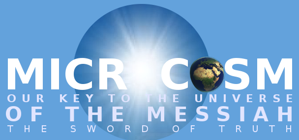

# His Heart and SOL



<iframe width="854" height="480" src="https://www.youtube.com/embed/bK463fcJebI" frameborder="0" allowfullscreen></iframe>



Through the lyrics of rock and roll, He speaks a woven message that ties ancient scripture to modern music; and links history and *langolier* together with a message that takes a bit of thinking to grasp.  Once you take the time to see what is being said, or not overtly said the [light of the Menorah of Chanukah](hamd.md/he_laughs.html) sheds understanding on more than just this one concept, but on the whole of the Bible.  It's more than just "sentences" hidden within words, they form the basis of a message--one which is lighting the history of humanity's improvement in the microcosm that is America.




The light shines clearly from the Menorah, which is the lamp that lights the eight crazy nights; it's a question, one that ties directly to the ['Sang' Rael](holy_water,_sang_rael.html)'s elucidation of the two letter key "AH."  With this addition, it's clearly a question that echoes through history to the **S**ons **o**f **L**iberty, Men.. or **A**ll **H**umanity?  It's a critique, one that isn't so obvious at first, but eventually proves that these particular names were chosen very specifically.  


<iframe width="854" height="480" src="https://www.youtube.com/embed/8lMOL7GaPWI" frameborder="0" allowfullscreen></iframe>


It's highlighted clearly in *Dazed and Confused*, a scene where we are reminded that the *Sons of Liberty* were not really fighting for "Liberty" at the time; and it would take hundreds of years of American History for the rights of women to be restored, and slavery abolished.  At the time, the name wouldn't have made much sense--but with the evolution of society it shows clear foreknowledge.  It's the *light* of the word, that history itself is the proof that even thousands of years ago when the Menorah was first named... it was designed to be a question posed to a group that He knew would one day exist, and that the anachronism of their name would be obvious... only now.

```
SOL:  Sons of Liberty... Statue of Liberty... See our Light?

or... is it just: Literally, "to leave alone" to be 
"without companions"; also, "uninhabited", from Latin 
```

It is the history that breathes the true word, and it is why we are the light of the flame; the living word.  In *They Stood up for Love* by Live, he says he gave his "heart and soul" to the one, and it's the one planet that is truly the *Heart* of Heaven, Earth.  That's the linguistic key to the second word, that it's through a jump in time of the letter "h" that reveals that Earth and Heart are only one letter apart.  It's "art" at the heart of the name.  In another Live song, he says "a million miles fall from grace, thank God I missed the *ground*..." and that word is the key to Earth.  It shows that the meaning of Adamah and Earth are tied together... and are highlighted passively by the lyrics that are the key to revealing more than just a message.  They reveal the way the message is being sent, subtly, and without our knowledge or understanding... through this passiveness, we are being given proof of the existence of the sender of the message.  A message that ties Genesis to the Maccabees, and to America.


Some commentary, from a discussion

When I call it ambiguous, I am referring specifically to "AH," which is a suffix whose linguistic meaning is something akin to "to swirl around." In the case of Adamah, which is Earth... it's a fairly easy jump to seeing how that could be "people."  It matches the reset of the sea definition, at http://sangrael.lamc.la.  The first two letters are not ambiguous, and are reinforced by Genesis 1.  It gives me comfort when I see a pattern in the very first sentence of the Bible.

In the case of "Allah," the definition--which I was given.. by God--has its first "word" spelled out for us.  That gives me a little more comfort, too.

Adding in the word "Menorah" makes it clear to me that we are talking about the "human species" and the first video goes so far as to say "this human story."  I think I've gotten a fair amount of evidence that this "AH" is not only intended to be "all humanity," but that it's intended to be the kind of thing we can derive... in exactly this way.  I would be very surprised if there was not significant additional evidence corroborating this in other ways.

As far as "SOL," I agree, it looks like I am arbitrarily deciding that it's "Sons of Liberty," but again... the song speaks clearly to me (the person who was "given" these definitions..."

I gave my heart and soul... to the one.


