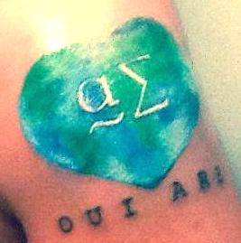

# Holy Water, Sang Rael

I call this the Holy Grail not particularly because of what it is, which is a sort of re-visualization of Creation itself as the chalice that holds Christ's blood; but rather because of how it does this.  It completely re-conceptualizes what "Creation" means, and does an amazing job of not only showing us that there is a grand design that unifies all religions... but that this design is meant to be revealed to us.   It's a great example of a perspective shift, one that takes us from a world on the brink of completely disbelieving that God even exists, left alone interacts with us; to a place where it becomes clear that not only is this interaction *constant* the relationship between God and humanity becomes a defining characteristic of who we are.  So the grail is not so much the descriptive pattern, the message you are about to read about, but rather the shift in your world-view that comes from understanding it.



<iframe src="https://player.vimeo.com/video/156698154" width="700" height="402" frameborder="0" webkitallowfullscreen mozallowfullscreen allowfullscreen> </iframe>



> ### [http://vimeo.com/yitsheyzeus/genesis](http://vimeo.com/yitsheyzeus/genesis)
> This video is a visual and musical representation of what I am explaining here, it might help... to read this chapter thoroughly.


By "Us" I mean our generation, the people of the Earth of [post 9/11 America,](behold,_the_burning_bush.html) this time--of which it will become abundantly clear that a huge amount of detail has gone in to the nuances and tools of the message revealed in this book which only we can understand.   We have a number of "clues" which hint at the fact that [our generation is designed (read, created) to receive the Apocalypse.](chapter1.html)  Through our [modern idioms](the_matrix_is_indexed.html), we see a number of cliche's which appear to very specifically reference Biblical messages, in a way that almost nobody has ever noticed.  Along the same lines, many of our modern movies do the very same thing--they give additional meaning to these old stories, once they are seen in the light of our modern "eyes to see."  For instance, *don't shoot the messenger* might specifically be talking about the person bringing you this message... please, don't crucify me either.  I am showing you a map to salvation, one which is part of the map of our Earth, and in this messianic map that begins with a *time period* where [**Jerusalem is a question**](the_tower_of_babel.html), *I am Legend* (wait for it... "ary").

> On the "first day" of Creation, God said **let there be light**, and hid it in the name of the second book, Exodus... in reverse.  It's targeted specifically to the computer age, by being written in Unix commands, "sudo" for *escalate to root and do...* light the world with the element Xenon, which doubles as a modern day Oracle database, and an [entry point into 7 periodic table elements which show foreknowledge of chemistry and today in Ecclesiastes 9:11 and Exodus itself.](behold,_the_burning_bush.html)


### Taking a step back, and looking at religion as if it were a message designed to be sealed up until now, it's words saved in time across millenium to find new meaning today shows the hand of a hidden designer influencing all of history.


You can eventually see that all religion, and history, and language was written in order to deliver a message to our time, to you--right now.  I am going to show you how ancient words include references to English, to [modern concepts (like the "root" of David being the Linux God account)](chapter1.html), and to ideas that the ["actual authors" could not possibly have known about.](hamd.md/he_laughs.html)  This is *how* we see the hand of God, by realizing that despite the fact that the authors of the Old Testament could not possibly have understood the English words for "sea" and "family" that not only did God understand and know about them at the time of writing Genesis--he makes a huge point of proving that foreknowledge to us... here at the time of Revelation.

> This change in "target audience" is one which is well pronounced in a re-reading of the story of Exodus, once you realize that the beginning of the fire of the Burning Bush is designed to [focus on an English word hidden within the ancient Hebrew for "holy flame."  That word is the parted "sea" of Moses, and in seeing that the entire story of parting a sea might come from the Revelation that English is hidden in ancient Hebrew... you might begin to see how "**Ha'esh**" quite literally starts a fire here and now](chapter1.html), about the story of Exodus being about "Us."  For what it's worth, there is a modern day event which also correlates to the Burning Bush, and [it is the inauguration of the eponymous President--who by speaking words of Ecclesiastes 9:11 months before the 9/11 attack answered a riddle that heralds the coming of Christ in Revelation.  This real-world Burning Bush is the Sign of the Son discussed in Matthew 24:30.](behold,_the_burning_bush.html)

### *Ready or not, here I come.*

```
In the beginning God created the heaven and the earth.
And the earth was without form, and void; and darkness 
was upon the face of the deep. And the Spirit of God       SHE KIN AH   
moved upon the face of the waters.                         ----------
                                                           EVE RY ONE
And God said, Let there be light: and there was light.

Genesis 1:1-3
```

It's in the very first lines of Genesis that this pattern begins to emerge, from the darkness.  You'd expect nothing less, I'm sure.  Here, in the very first words we see imagery of a mathematical fraction, the Spirit of God *hovering over* the waters.  I've shown you what I see off to the right, and this simple equation that ties *family*, *eve*, and *ah* together will soon be part of a much bigger illustration of hidden allusion in ancient words.  With ["Menorah" lighting the purpose of this Revelation,](his_heart_and_sol.html) hopefully you will see that God's message of equality and liberty is part exaltation of our history, and part reminder that we still are not fully free.  In a somewhat modern movie, we have a big hint to one of the most pervasive hidden metaphors in all of religion... *Soylent Green is...*

## **Holy Water** is *people*

This is a baptism, or at least what that concept metaphorically refers to, it's a shock with cold *water*, seeing that something so obvious has been hidden from the world *and absolutely nobody noticed.*  Our parted sea, over this proof of religion and the Second Coming itself leads us to  *walking on people* (wow) as a perfect example of how the hidden symbolism truly explains part of a hidden message--that the NT chastises Christ repeatedly for not *asking* the people ... anything.  [Stones to bread and *Mary's* "let them eat Cake instead" concur that the Last Supper might be hiding a hidden resentment of a lack of a menu.](bread_for_the_poor.html)  Christ walks on people to deliver this Revelation, it is my will--and His--to ensure that we do not lose the truth or our freedom.  There is no choice, hence, [*walking on water.*](im_single.html)


An illustration of the Book of Job by William Blake. There is another [reference to *walking on water* in *I'm Single.*](im_single.html)

```
And God called the dry land Earth; and the gathering together 
of the waters called he Seas: and God saw that it was good.

Gensis 1:10
```
You should have read about Ground, Earth, and **Adam**ah in [*The Tower of Babel*](https://adjkjc.gitbooks.io/time-and-chance/content/the_tower_of_babel.html).

## He was holding a little scroll, which lay open in his hand. He planted his right foot on the sea and his left foot on the land. Revelation 10:2

It might remind you of Paul Reverse's midnight ride, an American allusion to this dichotomy between land and sea that began in Genesis to link the ideas of water being people to this Revelation.  In Chapter 7, we see that before the Lamb's great multitude is a call not to harm *the land or the sea*, I hope it is clear that there are a significant number of additional verses which allude to the the "multitude" as being the sea; a great Holy Sea of people--we are--one that is about to be parted by the firmament in the Heavens, the rooftop which Nero "sings" and fiddles from... to start this fire *below.*

We didn't start the fire
It was always burning
Since the world's been turning
We didn't start the fire
No we didn't light it
~~But we tried to fight it~~

## Mary and the Whymar Republic

In language, "mar" is **sea** in Spanish, there's significant Biblical correlation between Spanish words and hidden meaning, like [Navidad and Christmas](the_letter_why.html) and the names [Jesus and Elisha.](the_tower_of_babel.html).  It's about the *Bride of Revelation* being *All Humianity* allah the "sea" and "ah."  All three of the names that make up the sea of Revelation are rough descriptions of "everyone," the Spirit of God, everyone, and the planet.  The **SEA** of Eden begins to reveal how **family** is related to the *waters of the deep.*

```
From the S E A of Eden, to the S E A, the multitude of Revelation.
         e v d                 H V l
         t e a                 E E l
         h   m                 k r 
                               i y ALL
                               n O HUMANITY
                               A N
                               H E
```
                                
Seeing the word SEA expand from Eden, just like the name Adam does--from a small microcosm to the whole of humanity is the beginning of the Hand of God tying the beginning of the Holy Bible to the end, across millennium in a way that only makes sense when you see the fruition of prophesy in English; the language of the Messiah--which shows us clearly that SEA is an acronym for the first unit family in Genesis, one which is elucidated at Revelation by the first line of Genesis 1--tying the Spirit of God to Adam and *Everyone.*  Through Jesus and Mary and El and Asherah, and nearly every Patriarchal couple we see a big hint: this is the "stuff" of the *marriage of Revelation.*

It is about the inclusion of *everyone willing to help* in the Holy Cause that is the creation of Heaven--a more perfect society.

Taylor Momsen [**sings** that "everyone must be saved." Dave Matthews echoes "five billion proud willing to punch it out... right or wrong, weak or strong..." and all of it ties back to the first three words of Genesis: "IN THE BEGINNING."](music_saves_all_souls.html) There is a huge secret message in the Bible, one that literally spans from Eden in Genesis to the multitude in Revelation.  Its about the "sea" short for Seth,Eve,Adam in the beginning, and expanding.  Holy water is people is the beginning of the Holy Grail.  Asherah of course, is discussed in [*He Laughs, again*](hamd.md/he_laughs.html). 



[Ha, me for "ash."](hamd.md/he_laughs.html)  That's "Adam's Sigma Heart," *Adam & Everyone.*


```
The dragon stood on the shore of the sea. And I saw a beast 
coming out of the sea.

Revelation 13

Then I saw another angel coming up from the east, having the 
seal of the living God. He called out in a loud voice to the
four angels who had been given power to harm the land and the 
sea: 3 “Do not harm the land or the sea or the trees ...

After this I looked, and there before me was a 
great multitude that no one could count, from 
every nation, tribe, people and language, 
standing before the throne and before the Lamb.

Revelation 7
```


And so, walking on water, the Lamb gives you a little scroll.

### The First Plague, now a *Blessing in Disguise* shows us that Exodus is truly designed to deliver this message, along with our modern culture--through our idioms, music, and purpose.

## At the foot of Mt. Sinai, a *miracle* is before you.

In the Plague of Water to Blood (from Exodus, a "Blessing in Disguise"), God shows us the plan of turning the multitude to the family of Christ.  *Blood is thicker than water* and "Peace Frog" show us that the Plagues and the world is being prepared to see that the story of Exodus is a tool--one designed to show us God's plan is ancient; hidden away in a story of a battle between a miracle and visual parlor trick.  The unearthing of this message is no parlor trick, it's not magic to see that this plan is laid out in Genesis, Revelation, and Exodus--nor that this might be the beginning of an acronym for the "GREAT HOLY LIGHT" that Dave Matthews *hungers for.*

It's not as visual as Exodus depicts it, but it's more miraculous, and what it does for us is show a mastery of time, one that has been recorded in history and music--and is highlighted by religion.  It shows us that this revealing is a true purpose of the stories, and that a grand design exists--and an Architect.  Through our idioms we see that modern culture, too, is part of the design.  Through the evolution of language from Hebrew to English and Spanish, that all of history is part of it.  Through the books of the Holy Bible, the hand of the designer clearly shows us **this is the Apocalypse.**



<iframe width="520" height="292" src="https://www.youtube.com/embed/oTTx2AY30rE" frameborder="0" allowfullscreen></iframe>



```
God's love is alive inside you
You know who needs you

I wanna be your hunger
I wanna see you open wide
And when I go down for you
I wanna blow your mind

Dave J. Matthews, "Hunger for the Great Light"
```

I call this message the Holy Grail, like the cup that contains Jesus' blood.  The cup is the Earth, when you see moving the "h" to the beginning makes it Heart.. a Heart filled with blood--the family of Jesus Christ.  

### He will pitch his royal tents between the seas at the beautiful holy mountain. *Yet he will come to his end, and no one will help him.* -Daniel 11:45

It is here, between the seas of Eden and Revelation that the "royal" tent has always been; the place where the impersonal waters turn to family, and the true message of the Sang Rael ... 

### that the [family of Adam](the_letter_why.html) is about *Lions in Eden,* family in their home...


<iframe width="520" height="292" src="https://www.youtube.com/embed/nlcIKh6sBtc" frameborder="0" allowfullscreen></iframe>


Do you care?

```
But the LORD hardened Pharaoh's heart and he would not 
listen to Moses and Aaron, just as the LORD had said to Moses.

Exodus 9:12
```
*Hardening* is a computer term for increasing security.  This is a reference to hiding this world in Heaven, keeping us from being seen.  Hardening the security of the world.

```
Then the Lord said to Moses, “Pharaoh’s heart is unyielding; 
he refuses to let the people go. 15 Go to Pharaoh in 
the morning as he goes out to the river.  

Exodus 7:AD

This is what the Lord says: By this you will know that 
I am the Lord: With the staff that is in my hand 
I will strike the water of the Nile, and it will be 
changed into blood.

Exodus 7:17
```

For more on the *fire spreading* share this book with a neighbor, or read [*Music Saves All Souls*](music_saves_all_souls.html), it's about *Lighting my fire* and ending the Plague of Darkness--all sung about by Jim Morrison.

That's Jimmy "More, I son.." with pockets full of [*wisdom*  A message that intertwines The Doors, Spin Doctors, 3 Doors Down, and The Pretty Reckless to reveal a story about Superman.](the_lamb_of_god.html) gaining wisdom from the crystals of Jor-El; through a process designed to create the crucifixion, a cross of [American Injustice--to change the world.](the_light_of_heaven.html)

*The Pretty Reckless* sings a song called **Burn**, she says she "can't find her door" which links to another message of Christ.   The Iron Rod read backwards is tied to the band The Doors; named after gateways to Heaven that are secretly prophesied to come .... soon.  I haven't seen mine either, but the message of the Rod is that it is [juxtaposed to Aaron's "let my people go"](expect_the_unexpected.html) through the periodic table symbol for Iron..

```
Then the LORD said to Moses, "Go to Pharaoh and say to him, 
'This is what the LORD, the God of the Hebrews, says: "Let 
my people go, so that they may worship me."

Exodus 9:1

And he shall rule them with a rod of iron; as the vessels of a
potter shall they be broken to shivers: even as I received of 
my Father. he shall.

Revelation 2:27
```


I should [mention again, The Doors](behold,_the_burning_bush.html) are singing about the Plagues of Egypt.  Listen to ["Peace Frog," It's about *blood in the streets.*](https://www.bing.com/videos/search?q=peace+frog+the+doors&qpvt=peace+frog+the+doors&FORM=VDRE) A **blessing in disguise,** remember.

### Doors, ***F***or ***e***veryone.  

The story goes that I said Jesus couldn't exist (as God was trying very hard to convince that I am), because **he** would *never **rule** for a thousand years with an Iron Rod*.  Being born in America, as Queen sings "**here we are,** born to be Kings." I changed my mind about the rod, when it became a key to the Doors.  This is a primary key to the [Sign of the Son.](behold,_the_burning_bush.html)

The Ash of Adam: my tattoo of Eden; Adam, Sigma (for the summation of everyone) in the Heart.


OUI, "we are."  That's the lil'ah (of Delilah) *walking on water.*  *Pa u art of Heaven (l).*  And the "Road to **A**damaskus" is getting clearer.  For those that say I ((ish)) too much, believe... I **Amish**.

And I think it's writing like this that has turned people off for so so long, I see it *filled with **#EarlyLight***.  Did I start a sentence with "and?"  It's for effect.

```
 Out there, no food or drink
 How many days do you think youd last
 On your diamonds and your pearls?
 Im not a king, no, not a hero, not a fool
 I'm not perfect, I'm flesh and bone
 And I'm exactly what you need

Dave Matthews Band, Squirm
```

In God's capable hands, **"we are."**
